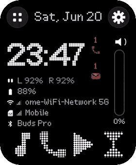
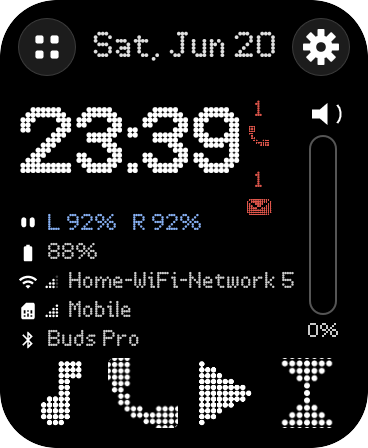
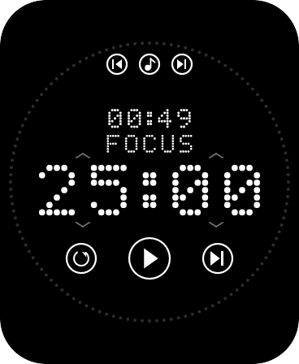
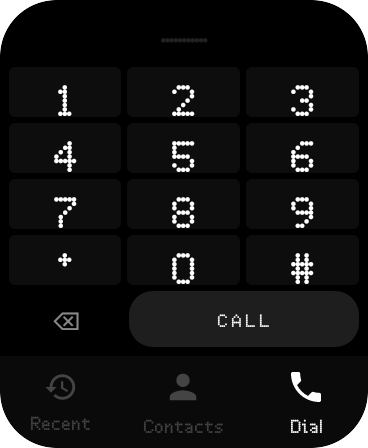

# ikko-ab02 — a usable, Google-free home for the IKKO Activebuds AB02

Turn the IKKO **Activebuds AB02** (the tiny Android earbuds-*case* with a 368×448 round-ish screen) into a
genuinely usable mini-smartwatch — a custom launcher, dialer, and focus timer in a Nothing-style dot-matrix
theme, plus real **YouTube / YouTube Music** (via ReVanced + microG), maps, and a keyboard — **no root, no
Google Play Services**.

Everything here is reproducible: plug in your AB02, open Claude Code, and follow [`CLAUDE.md`](CLAUDE.md) to get
the same setup.

> **Device:** IKKO AB02 · Android 8.1 (API 27) · armeabi-v7a (32-bit) · no GMS · locked bootloader ·
> 368×448 px @ **160 dpi (density 1.0, so dp == px)** · off-screen capacitive edge bar.

---

## What's in here (our open-source apps)

| App | Package | What it is |
|-----|---------|-----------|
| [launcher-app](launcher-app/README.md) | `com.mw.launcher` | Dot-matrix watch-face home: big clock, stats, app dock, right-edge **Volume/Media/Brightness** rail mapped to the physical edge bar, missed-call / unread-SMS badges. |
| [dialer-app](dialer-app/README.md) | `com.mw.dialer` | Minimal dialer/caller: Recent · Contacts · Dial, alphabet scrubber, vCard import, missed-call dot. |
| [pomodoro-app](pomodoro-app/README.md) | `com.mw.focus` | "Focus" interval timer — dotted hero countdown, 120-dot progress ring, drag-to-set, media transport. (Not "Pomodoro", no tomatoes.) |
| [touch-app](touch-app/README.md) | `com.mw.touch` | Digitizer / edge-bar test surface — paints every touched pixel, overlays the launcher's slider hit-zones. |
| [claude-app](claude-app/README.md) | `com.mw.claude` | GeckoView wrapper around `claude.ai` (you log in on the site — no API key). |

Third-party pieces (microG, YouTube, YouTube Music, Organic Maps, Gboard) are **installed**, not bundled —
see [`SETUP.md`](SETUP.md) for exactly how.

## Screenshots

The launcher in motion — the right-edge rail switching **Volume → Brightness → Media** and a long Wi-Fi name
marquee-scrolling (stats faked; no real network/contacts shown):

<p align="center"></p>

| Home | Focus timer | Dialer |
|------|-------------|--------|
|  |  |  |

*(Shown with an OFL dot-matrix font — the original Nothing fonts are not redistributable; see
[`FONTS.md`](FONTS.md). Corners rounded to match the device's physical screen.)*

## Quick start

1. **Prereqs** (laptop): JDK 17, Android `platform-tools` (adb), and an Android SDK (`platforms;android-34` +
   `build-tools`). Point Gradle at the SDK via `ANDROID_HOME` or a per-app `local.properties` (`sdk.dir=...`).
2. **Fonts** (optional but recommended): drop an OFL dot font in per [`FONTS.md`](FONTS.md).
3. **Build + install one app:**
   ```bash
   cd launcher-app
   ANDROID_HOME=$HOME/Android/sdk ./gradlew assembleDebug
   adb install -r app/build/outputs/apk/debug/app-debug.apk
   ```
4. **Full setup** (all apps, permissions, microG/YouTube/maps/keyboard, default launcher, vCard): follow
   [`SETUP.md`](SETUP.md) — or just let Claude Code drive it via [`CLAUDE.md`](CLAUDE.md).

## Docs
- [`CLAUDE.md`](CLAUDE.md) — **AI build instructions**: hand this to Claude Code on a fresh laptop + AB02.
- [`SETUP.md`](SETUP.md) — manual end-to-end setup (apps, permissions, microG, ReVanced, maps, keyboard, vCard).
- [`FONTS.md`](FONTS.md) — why no fonts are shipped + open replacements.
- [`NOTICE.md`](NOTICE.md) — third-party licenses.
- Each app folder has its own `README.md`.

## License
MIT — see [`LICENSE`](LICENSE). Covers only the code in this repo; third-party components keep their own
licenses, and the proprietary Nothing/OffBit fonts are **not** included.

---
**ikko-ab02** · https://github.com/vitkovit/ikko-ab02
